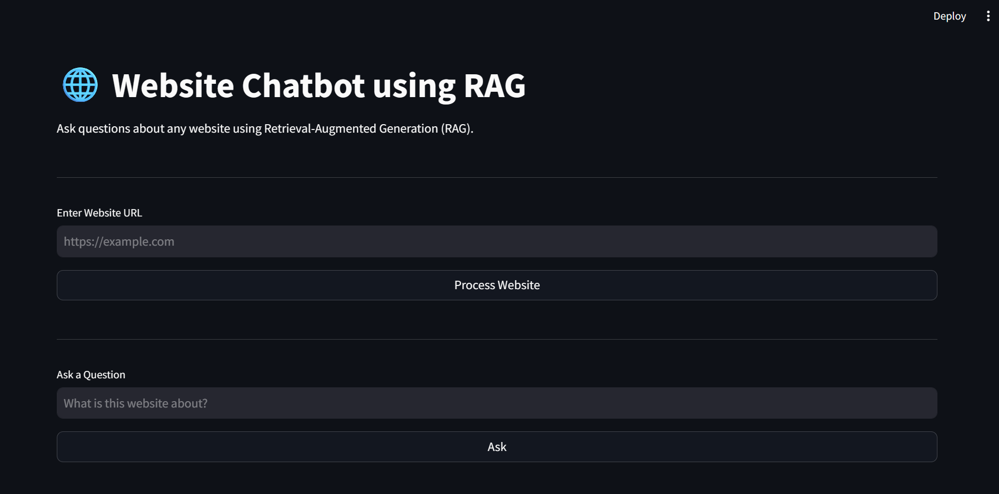
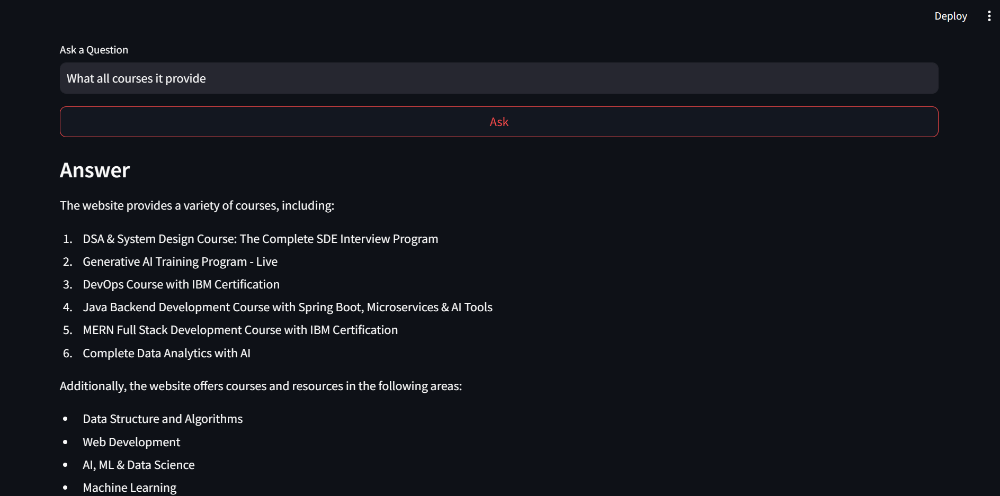

# Chat With Website

A **Retrieval-Augmented Generation (RAG)** based chatbot that allows users to ask questions about any website. The application extracts website content, converts it into vector embeddings, retrieves the most relevant information for a query, and generates accurate responses using a Large Language Model (LLM).

This project demonstrates an end-to-end **RAG pipeline** built using the latest **LangChain ecosystem**, **Groq LLM**, **HuggingFace Embeddings**, **ChromaDB**, and **Streamlit**.

---

## Demo

| Home Page | Answer Generation |
|-----------|-------------------|
|  |  |

---

## Features

- Process any publicly accessible website using its URL
- Extract website content automatically
- Split website content into semantic chunks
- Generate vector embeddings using HuggingFace Sentence Transformers
- Store embeddings in Chroma Vector Database
- Retrieve relevant information using Maximum Marginal Relevance (MMR)
- Generate context-aware answers using Groq LLM
- Built using LangChain Expression Language (LCEL)
- Interactive Streamlit web interface

---

## Project Workflow

```text
                     Website URL
                          │
                          ▼
                  WebBaseLoader
                          │
                          ▼
                 Document Loading
                          │
                          ▼
          RecursiveCharacterTextSplitter
                          │
                          ▼
             HuggingFace Embeddings
                          │
                          ▼
               Chroma Vector Database
                          │
                          ▼
                   MMR Retriever
                          │
                          ▼
                 Retrieved Context
                          │
                          ▼
              Prompt + User Question
                          │
                          ▼
                    Groq LLM (LCEL)
                          │
                          ▼
                 Generated Response
```

---

## Tech Stack

| Category | Technologies |
|----------|--------------|
| Language | Python |
| Framework | Streamlit |
| LLM | Groq (Llama 3.3 70B Versatile) |
| Framework | LangChain |
| Embeddings | HuggingFace Sentence Transformers |
| Vector Database | ChromaDB |
| Document Loader | WebBaseLoader |
| Text Splitter | RecursiveCharacterTextSplitter |

---

## Project Structure

```text
Website-Chatbot/
│
├── app.py
├── requirements.txt
├── .env
├── .gitignore
├── README.md
│
├── data/
│   └── chroma_db/
│
└── src/
    ├── config.py
    ├── loader.py
    ├── splitter.py
    ├── vector_store.py
    ├── retriever.py
    ├── rag_chain.py
    ├── prompt.py
    └── utils.py
```

---

## How It Works

### 1. Website Loading

The user enters a website URL. The application loads the website content using **LangChain's WebBaseLoader**.

---

### 2. Text Splitting

The extracted content is divided into smaller overlapping chunks using **RecursiveCharacterTextSplitter**, improving retrieval quality and preserving context.

---

### 3. Embedding Generation

Each document chunk is converted into a dense vector representation using **HuggingFace Sentence Transformers**.

---

### 4. Vector Storage

The generated embeddings are stored inside **ChromaDB**, enabling efficient semantic similarity search.

---

### 5. Context Retrieval

When the user asks a question, the application retrieves the most relevant chunks using **Maximum Marginal Relevance (MMR)** to improve diversity while minimizing redundant results.

---

### 6. Response Generation

The retrieved context and the user's question are passed through a custom prompt template to the **Groq LLM** using **LangChain Expression Language (LCEL)**, producing a context-aware response.

---

## Installation

### 1. Clone the Repository

```bash
git clone https://github.com/your-username/website-chatbot.git

cd website-chatbot
```

---

### 2. Create a Virtual Environment

```bash
python -m venv .venv
```

Activate the environment.

#### Windows

```bash
.venv\Scripts\activate
```

#### Linux / macOS

```bash
source .venv/bin/activate
```

---

### 3. Install Dependencies

```bash
pip install -r requirements.txt
```

---

### 4. Configure Environment Variables

Create a `.env` file in the project root.

```env
GROQ_API_KEY=your_groq_api_key
```

---

## Run the Application

```bash
streamlit run app.py
```

---

## Usage

1. Launch the Streamlit application.
2. Enter a valid website URL.
3. Click **Process Website**.
4. Wait for the website to be processed.
5. Ask questions related to the website.
6. Receive context-aware answers generated using RAG.

---

## Example Questions

- What is this website about?
- Summarize the homepage.
- What services does this company provide?
- What technologies are mentioned?
- What products are available?
- Who is the target audience?
- What are the key features of this platform?

---

## Key Concepts Used

- Retrieval-Augmented Generation (RAG)
- LangChain Expression Language (LCEL)
- Prompt Engineering
- Semantic Search
- Vector Embeddings
- Chroma Vector Database
- HuggingFace Embeddings
- Maximum Marginal Relevance (MMR)
- Large Language Models (LLMs)

---

## Future Improvements

- Multi-page website crawling
- Conversation memory
- Chat history
- Source citations with responses
- Multiple LLM provider support
- Persistent vector database
- Docker deployment
- Streamlit Cloud deployment
- Support for PDF and document chat
- Authentication for private websites

---

## Learning Outcomes

This project demonstrates practical implementation of:

- End-to-end Retrieval-Augmented Generation (RAG)
- LangChain components and pipelines
- LangChain Expression Language (LCEL)
- Website document loading
- Document chunking
- Vector embeddings
- Semantic retrieval
- Prompt engineering
- Large Language Model integration
- Streamlit application development

---

## Author

**Harsh Agarwal**